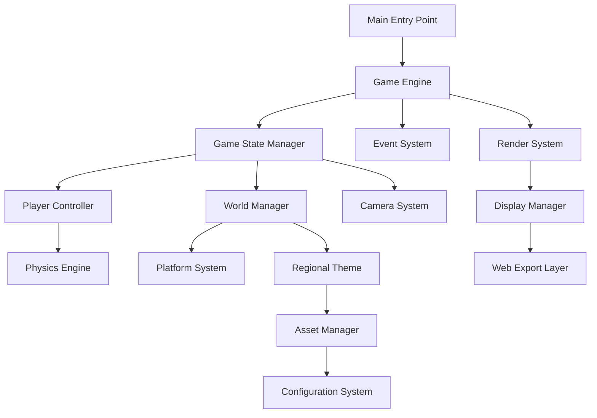

# Design Document: Ingushetia 2D Platformer

## Overview

The Ingushetia 2D Platformer is a cultural heritage game built with Pygame that showcases Ingush tower complexes through interactive gameplay. The architecture follows a modular design pattern with clear separation between game engine, player systems, world generation, and regional theming. The game is designed for both desktop and web deployment using Pygbag, requiring async-aware code structure.

The core design philosophy emphasizes cultural authenticity through configurable regional themes, starting with Ingushetia, while maintaining a flexible architecture for future regional expansions. The game uses a component-based entity system for maintainability and extensibility.

## Architecture

The system follows a layered architecture with clear separation of concerns:



**Layer Responsibilities:**
- **Presentation Layer**: Pygame rendering, input handling, web compatibility
- **Game Logic Layer**: Player movement, physics, collision detection, world generation
- **Data Layer**: Asset management, configuration loading, regional themes
- **Infrastructure Layer**: Async game loop, event system, state management

## Components and Interfaces

### Game Engine Core

**GameEngine Class**
```python
class GameEngine:
    async def run(self) -> None
    def update(self, delta_time: float) -> None
    def render(self) -> None
    def handle_events(self) -> None
    def get_state(self) -> GameState
    def set_state(self, state: GameState) -> None
```

The GameEngine manages the main async game loop required for Pygbag compatibility. It coordinates all subsystems and maintains consistent 60 FPS timing using delta time calculations.

**EventSystem Interface**
```python
class EventSystem:
    def register_handler(self, event_type: str, handler: Callable) -> None
    def emit_event(self, event_type: str, data: Dict) -> None
    def process_events(self) -> None
```

### Player System

**Player Class**
```python
class Player:
    def __init__(self, x: float, y: float)
    def update(self, delta_time: float, input_state: InputState) -> None
    def handle_collision(self, collision_data: CollisionData) -> None
    def get_position(self) -> Tuple[float, float]
    def get_bounds(self) -> pygame.Rect
```

**PlayerController Interface**
```python
class PlayerController:
    def process_input(self, keys: Dict[int, bool]) -> InputState
    def apply_physics(self, player: Player, delta_time: float) -> None
    def check_collisions(self, player: Player, platforms: List[Platform]) -> List[CollisionData]
```

The player system implements realistic platformer physics with gravity, jumping mechanics, and collision response. Movement is frame-rate independent using delta time.

### World Generation System

**WorldManager Class**
```python
class WorldManager:
    def __init__(self, theme_config: RegionalTheme)
    def generate_level(self, level_id: str) -> Level
    def get_platforms(self) -> List[Platform]
    def update(self, delta_time: float) -> None
```

**Platform Class**
```python
class Platform:
    def __init__(self, x: float, y: float, width: float, height: float, texture: str)
    def get_collision_rect(self) -> pygame.Rect
    def render(self, surface: pygame.Surface, camera_offset: Tuple[float, float]) -> None
```

The world system generates levels based on Ingush tower complex architecture patterns, ensuring all platforms are reachable and creating engaging gameplay flow.

### Camera System

**Camera Class**
```python
class Camera:
    def __init__(self, viewport_width: int, viewport_height: int)
    def follow_target(self, target_pos: Tuple[float, float]) -> None
    def get_offset(self) -> Tuple[float, float]
    def world_to_screen(self, world_pos: Tuple[float, float]) -> Tuple[int, int]
    def set_bounds(self, min_x: float, max_x: float, min_y: float, max_y: float) -> None
```

The camera provides smooth following behavior with configurable bounds to prevent showing empty areas outside the level boundaries.

### Regional Theme System

**RegionalTheme Class**
```python
class RegionalTheme:
    def __init__(self, config_path: str)
    def load_assets(self) -> Dict[str, pygame.Surface]
    def get_platform_texture(self, platform_type: str) -> pygame.Surface
    def get_background(self) -> pygame.Surface
    def get_player_sprite(self) -> pygame.Surface
```

**Configuration Structure (ingushetia.json)**
```json
{
    "name": "Ingushetia",
    "assets": {
        "background": "assets/ingushetia/background.png",
        "platform": "assets/ingushetia/platform.png",
        "player": "assets/ingushetia/player.png"
    },
    "gameplay": {
        "gravity": 980.0,
        "jump_force": 400.0,
        "move_speed": 200.0
    },
    "level_generation": {
        "platform_density": 0.3,
        "tower_height_range": [100, 300],
        "architectural_style": "ingush_towers"
    }
}
```

## Data Models

### Core Game Objects

**GameState Enumeration**
```python
class GameState(Enum):
    MENU = "menu"
    PLAYING = "playing"
    PAUSED = "paused"
    GAME_OVER = "game_over"
```

**InputState Data Class**
```python
@dataclass
class InputState:
    move_left: bool
    move_right: bool
    jump: bool
    crouch: bool
    delta_time: float
```

**CollisionData Structure**
```python
@dataclass
class CollisionData:
    platform: Platform
    collision_side: str  # "top", "bottom", "left", "right"
    penetration_depth: float
    normal: Tuple[float, float]
```

**Level Configuration**
```python
@dataclass
class LevelConfig:
    width: int
    height: int
    platforms: List[Dict[str, Any]]
    spawn_point: Tuple[float, float]
    theme: str
```

### Physics Data Models

**Vector2D Class**
```python
class Vector2D:
    def __init__(self, x: float, y: float)
    def __add__(self, other: 'Vector2D') -> 'Vector2D'
    def __mul__(self, scalar: float) -> 'Vector2D'
    def magnitude(self) -> float
    def normalize(self) -> 'Vector2D'
```

**PhysicsBody Component**
```python
@dataclass
class PhysicsBody:
    position: Vector2D
    velocity: Vector2D
    acceleration: Vector2D
    mass: float
    friction: float
    restitution: float
```

## Correctness Properties

*A property is a characteristic or behavior that should hold true across all valid executions of a system—essentially, a formal statement about what the system should do. Properties serve as the bridge between human-readable specifications and machine-verifiable correctness guarantees.*

Before defining the correctness properties, I need to analyze the acceptance criteria from the requirements to determine which ones are testable as properties.
